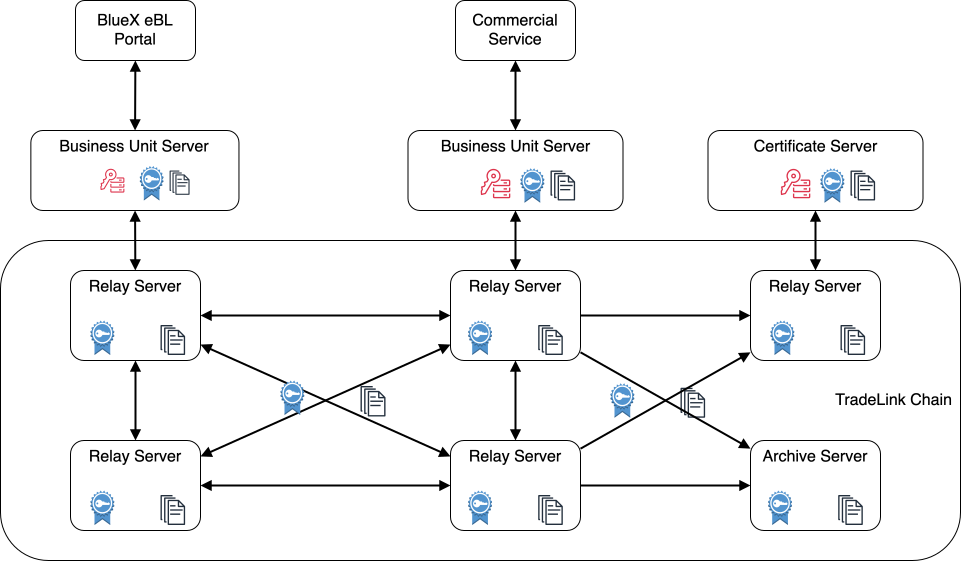

# OpenEBL Core Stack

The three components form the core stack of OpenEBL.

1. Relay Server
   This provides the network to exchange/broadcast messages between different components.
2. Certificate Authority Server
   This provides certificates management feature. All issued certificates will be published to the relay network.
3. Business Unit Server
   This provides business unit management and trade document management feature.



## How a business unit is onboarded

### Prerequisites

- Relay servers already form the network. (Single instance of relay server is enough) [Relay Server](pkg/relay/server/README.md)
- Certificate Authority Server is running and well initialized. [CA Server](pkg/cert_server/README.md)
- Business Unit Server is running and well initialized. [BU Server](pkg/bu_server/README.md)
  - Application is registered and its API Key is generated.

### Manual Onboarding Process

To onboard a business unit without using the CLI, you need to perform these steps manually through API calls:

1. **Create the business unit**

   - Make a request to the Business Unit Server to create a new business unit with required information:
     - Business unit name
     - Address(es)
     - Country code
     - Email address(es)
     - Phone number(s)
     - Status (active or inactive)
   - The server will respond with a business unit ID

2. **Create authentication for the business unit**

   - Make a request to the Business Unit Server to create authentication for the business unit
   - Provide:
     - Business unit ID
     - Key type (RSA or ECDSA)
     - Bit length (e.g., 2048 for RSA)
   - The server will generate a Certificate Signing Request (CSR) and private key

3. **Submit the CSR to the CA server**

   - Make a request to the Certificate Authority Server to register the CSR
   - The CA server will respond with a certificate ID

4. **Find an active CA certificate or use a specified one**

   - Query the CA Server to find active CA certificates
   - Select an appropriate CA certificate to use for signing

5. **Sign the CSR with the CA certificate**
   - Make a request to the CA Server to sign the CSR using the selected CA certificate
   - The signed certificate will be published to the relay network
   - The Business Unit Server will synchronize the certificate

### Using the OpenEBL CLI for Onboarding

The OpenEBL CLI automates all the above steps in a single command:

```bash
./openebl-cli onboard \
    -b <business-unit-server-url> \
    -c <ca-server-url> \
    --api-key <api-key> \
    --requester <requester-name> \
    --name "Business Unit Name" \
    --addresses "Business Unit Address" \
    --country "Country Code" \
    --emails "email@example.com" \
    --phone-numbers "+1-555-123-4567" \
    --ca-cert-id <ca-certificate-id> \
    --key-type RSA \
    --bit-length 2048
```

Required parameters:

- `--name`: Name of the business unit
- `--country`: Country code (e.g., US, TW, CN)
- `--emails`: Email address(es)
- `--requester`: Name of the requester

Optional parameters:

- `--addresses`: Physical address(es) of the business unit
- `--phone-numbers`: Phone number(s)
- `--status`: Status of business unit (default: active)
- `--key-type`: Key type for authentication (default: RSA)
- `--bit-length`: Bit length for RSA keys (default: 2048)
- `--ca-cert-id`: ID of a specific CA certificate to use (if not provided, the CLI will try to find an active one)

Example:

```bash
./openebl-cli onboard \
    -b http://openebl_bu_server:8080 \
    -c http://openebl_ca_server:9100 \
    --api-key "your-api-key" \
    --requester DevOps \
    --name "ABC Trading Company" \
    --addresses "123 Commerce St, Business City, 12345" \
    --country "US" \
    --emails "contact@abctrading.com" \
    --phone-numbers "+1-555-987-6543"
```

The CLI will execute all five steps of the onboarding process and provide progress updates during execution.
